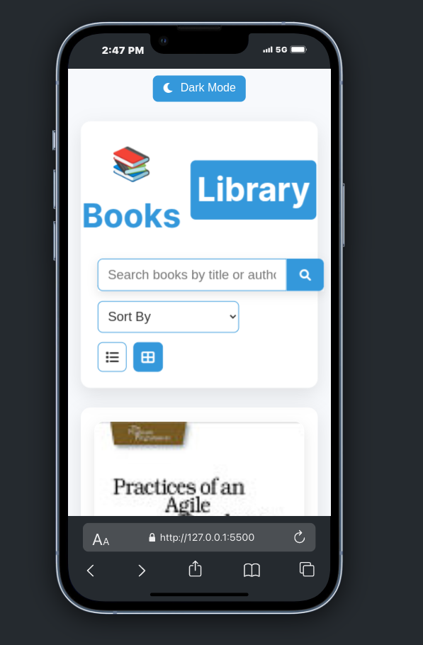

# 📚 Books Library Web Application

## Overview
A dynamic web application that fetches and displays book data from the FreeAPI.app Books API. Users can search, sort, and browse books with an intuitive interface.

## Features
- Fetch books dynamically from API
- Grid and List view toggle
- Search books by title or author
- Sort books by title and publication date
- Pagination support
- Responsive design
- Click to view book details in a new tab

## Technologies Used
- HTML5
- CSS3
- JavaScript
- FreeAPI.app Books API

## Screenshots

### Desktop View - Grid Layout

### Desktop View - List Layout

### Mobile Responsive View

### Search and Sort Functionality

- sort

### Dark Mode view

## Live Demo
[Click here](https://find-book-1.netlify.app/)

## Setup and Installation
1. Clone the repository
2. Open `index.html` in your browser
3. No additional setup required!

## API Reference
- API Endpoint: https://api.freeapi.app/api/v1/public/books
- Documentation: https://freeapi.hashnode.space/api-guide/apireference/getBooks

## Deployment
Deployed [here](https://find-book-1.netlify.app/)
